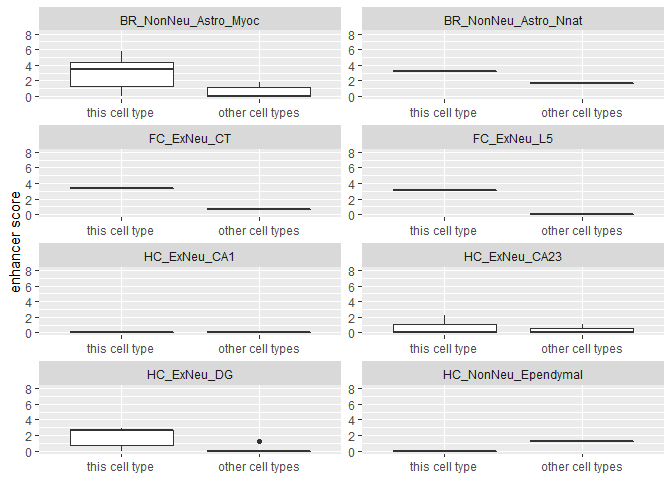

Gene Association Tutorial
================

In this tutorial, we will go through the steps to obtain the gene-peak
association.

## GitHub Documents

``` r
start.time <- Sys.time()
```

``` r
# load packages
library(GenomicRanges)
library(ChIPpeakAnno)
library(Signac)
library(sn)

library(data.table)
library(tibble)
library(Matrix)
library(dplyr)
library(gtools)
library(ggplot2)
library(ggforce)
```

After loading the needed packages, we read in data, preprocess and then
aggregate them across cell types.

``` r
# read in data
rna_matrix <- readMM("./PairedTagATAC_RNA.mtx")
bc <- fread("./barcodes.tsv", header=F)
genes <- fread("./genes.tsv", header=F)[[1]] 
metadata <- fread("./metadata.csv")
dna_matrix <- t(readMM("./PairedTagATAC.mtx"))
peakname <- fread("./peaks.bed")
rownames(dna_matrix) <- rownames(rna_matrix) <- bc[[1]]
colnames(dna_matrix) <- paste(peakname[[1]],peakname[[2]],peakname[[3]],sep='_')
PairedTagATAC_metadata <- metadata[match(rownames(dna_matrix),metadata$Cell_ID),]
```

``` r
# truncate RNA matrix to 99% quantile, and binarize ATAC matrix
threshold <- quantile(rna_matrix[rna_matrix>0],0.99)
```

    ## <sparse>[ <logic> ] : .M.sub.i.logical() maybe inefficient

``` r
rna_matrix[rna_matrix>threshold] <- threshold
dna_matrix <- dna_matrix > 0
# aggregate the counts across cell types
rna_matrix_agg <- dna_matrix_agg <- c()
for (i in seq_along(unique(metadata$Membership))){
  rna_matrix_agg <- rbind(rna_matrix_agg,colSums(rna_matrix[PairedTagATAC_metadata$Membership == unique(PairedTagATAC_metadata$Membership)[i],]))
  dna_matrix_agg <- rbind(dna_matrix_agg,colSums(dna_matrix[PairedTagATAC_metadata$Membership == unique(PairedTagATAC_metadata$Membership)[i],]))  
}
rownames(rna_matrix_agg) <- rownames(dna_matrix_agg) <- unique(PairedTagATAC_metadata$Membership)
rna_matrix_agg <- Matrix(rna_matrix_agg, sparse=T)
dna_matrix_agg <- Matrix(dna_matrix_agg, sparse=T)
celltypesum <- rowSums(rna_matrix_agg)
# calculate H for RNA matrix and normalize ATAC matrix
H <- celltypesum / median(celltypesum)
dna_matrix_agg <- log(dna_matrix_agg / rowSums(dna_matrix_agg) * median(rowSums(dna_matrix_agg)) + 1)
```

Next, we use `TSS.mouse.GRCm38` in `ChIPpeakAnno` package as reference
data, and use `DistanceToTSS` in `Signac` package to obtain the hit
matrix of genes and peaks within 50K distance.

``` r
peaks.gr <- GRanges(peakname[[1]], IRanges(peakname[[2]], peakname[[3]]))
# use TSS.mouse.GRCm38 in the ChIPpeakAnno package as reference data
data(TSS.mouse.GRCm38) 
seqlevelsStyle(TSS.mouse.GRCm38) <- 'UCSC'
AnnotationData <- TSS.mouse.GRCm38[names(TSS.mouse.GRCm38) %in% genes]
# obtain the hit matrix of genes and peaks within 50K distance
HitMat <- suppressWarnings(Signac:::DistanceToTSS(peaks=peaks.gr, genes=AnnotationData, distance = 50000))
colnames(HitMat) <- names(AnnotationData)
rownames(HitMat) <- colnames(dna_matrix)
HitMat <- HitMat[,colSums(HitMat)!=0]

genes_used <- genes[match(colnames(HitMat),genes)]
rna_matrix_agg <- rna_matrix_agg[,match(genes_used,genes)]
dna_matrix_agg <- dna_matrix_agg[,match(rownames(HitMat),colnames(dna_matrix_agg))]
```

Now it’s time to generate a list containing the data of candidate
gene-peak pairs. For the purpose of this tutorial, we only pick 100
genes with their candidate peaks for the later step. In practice, we
should generate a list of all genes with their candidate peaks.

``` r
genenum <- length(genes_used)
datalist <- list()
for (i in 1:100){
  cat("combine list", i, "of", genenum,"\n")
  datalist<-c(datalist,list(cbind(rna_matrix_agg[,i],dna_matrix_agg[,HitMat[,i]>0,drop=F])))
}
```

    ## combine list 1 of 31733 
    ## combine list 2 of 31733 
    ## combine list 3 of 31733 
    ## combine list 4 of 31733 
    ## combine list 5 of 31733 
    ## combine list 6 of 31733 
    ## combine list 7 of 31733 
    ## combine list 8 of 31733 
    ## combine list 9 of 31733 
    ## combine list 10 of 31733 
    ## combine list 11 of 31733 
    ## combine list 12 of 31733 
    ## combine list 13 of 31733 
    ## combine list 14 of 31733 
    ## combine list 15 of 31733 
    ## combine list 16 of 31733 
    ## combine list 17 of 31733 
    ## combine list 18 of 31733 
    ## combine list 19 of 31733 
    ## combine list 20 of 31733 
    ## combine list 21 of 31733 
    ## combine list 22 of 31733 
    ## combine list 23 of 31733 
    ## combine list 24 of 31733 
    ## combine list 25 of 31733 
    ## combine list 26 of 31733 
    ## combine list 27 of 31733 
    ## combine list 28 of 31733 
    ## combine list 29 of 31733 
    ## combine list 30 of 31733 
    ## combine list 31 of 31733 
    ## combine list 32 of 31733 
    ## combine list 33 of 31733 
    ## combine list 34 of 31733 
    ## combine list 35 of 31733 
    ## combine list 36 of 31733 
    ## combine list 37 of 31733 
    ## combine list 38 of 31733 
    ## combine list 39 of 31733 
    ## combine list 40 of 31733 
    ## combine list 41 of 31733 
    ## combine list 42 of 31733 
    ## combine list 43 of 31733 
    ## combine list 44 of 31733 
    ## combine list 45 of 31733 
    ## combine list 46 of 31733 
    ## combine list 47 of 31733 
    ## combine list 48 of 31733 
    ## combine list 49 of 31733 
    ## combine list 50 of 31733 
    ## combine list 51 of 31733 
    ## combine list 52 of 31733 
    ## combine list 53 of 31733 
    ## combine list 54 of 31733 
    ## combine list 55 of 31733 
    ## combine list 56 of 31733 
    ## combine list 57 of 31733 
    ## combine list 58 of 31733 
    ## combine list 59 of 31733 
    ## combine list 60 of 31733 
    ## combine list 61 of 31733 
    ## combine list 62 of 31733 
    ## combine list 63 of 31733 
    ## combine list 64 of 31733 
    ## combine list 65 of 31733 
    ## combine list 66 of 31733 
    ## combine list 67 of 31733 
    ## combine list 68 of 31733 
    ## combine list 69 of 31733 
    ## combine list 70 of 31733 
    ## combine list 71 of 31733 
    ## combine list 72 of 31733 
    ## combine list 73 of 31733 
    ## combine list 74 of 31733 
    ## combine list 75 of 31733 
    ## combine list 76 of 31733 
    ## combine list 77 of 31733 
    ## combine list 78 of 31733 
    ## combine list 79 of 31733 
    ## combine list 80 of 31733 
    ## combine list 81 of 31733 
    ## combine list 82 of 31733 
    ## combine list 83 of 31733 
    ## combine list 84 of 31733 
    ## combine list 85 of 31733 
    ## combine list 86 of 31733 
    ## combine list 87 of 31733 
    ## combine list 88 of 31733 
    ## combine list 89 of 31733 
    ## combine list 90 of 31733 
    ## combine list 91 of 31733 
    ## combine list 92 of 31733 
    ## combine list 93 of 31733 
    ## combine list 94 of 31733 
    ## combine list 95 of 31733 
    ## combine list 96 of 31733 
    ## combine list 97 of 31733 
    ## combine list 98 of 31733 
    ## combine list 99 of 31733 
    ## combine list 100 of 31733

``` r
names(datalist) <- genes_used[1:100]

# The full datalist is generated using the following code:
# for (i in 1:genenum){
#   cat("combine list", i, "of", genenum,"\n")
#   datalist<-c(datalist,list(cbind(rna_matrix_agg[,i],dna_matrix_agg[,HitMat[,i]>0,drop=F])))
# }
# names(datalist) <- genes_used
```

With the generated list, we can directly use `MASS::glm.nb` to perform
negative binomial regression. This function also gives us the
information of the p-values of the fitted parameter, z-values and Cook’s
distance (using the `cooks.distance` function).

``` r
# filter genes with 0 count
datalist <- datalist[-which(sapply(datalist,function(x) sum(x[,1])==0))]
cellnum <- nrow(datalist[[1]])
set.seed(2021)
alt_list <- suppressWarnings(lapply(datalist,function(x) { apply(x[,2:ncol(x),drop=F],2, function(y) {
  tmp <- try(MASS::glm.nb(x[,1]~y+log(H)))
  if ('try-error' %in% class(tmp)) return(NULL)
  return(tmp)
  })
})
)
nul_index <- which(sapply(alt_list,is.null))
if (length(nul_index))  alt_list <- alt_list[-nul_index]
alt_list <- sapply(alt_list,function(x) x[!(sapply(x,is.null))])
glm_pval <- lapply(alt_list,sapply,function(x) {coef(summary(x))[2,4]})
glm_qval <- qvalue::qvalue(unlist(glm_pval),pi0=1,fdr.level = 0.05)$qvalues
glm_qval <- relist(glm_qval,glm_pval)
zvalue_ori <- lapply(alt_list,sapply,function(x) {coef(summary(x))[2,3]})
cooksdist <- sapply(alt_list,sapply,cooks.distance)
```

To obtain calibrated p-values, we permute the data, obtain the z-values
by fitting negative binomial regression on the permuted data and then
fit a skewed t-distribution on the z-values.

``` r
zvalues_perm <- c()
for (i in 1:10){
  set.seed(2021+i)
  cellnum <- nrow(datalist[[1]])
  pmtindex <- sample(cellnum)
  subset <- sample(length(datalist),50)
  alt_list <- suppressWarnings(lapply(datalist[subset],function(x) { apply(x[pmtindex,2:ncol(x),drop=F],2, function(y) {
    tmp <- try(MASS::glm.nb(x[,1]~y+log(H)))
    if ('try-error' %in% class(tmp)) return(NULL)
    return(tmp)
    })
  })
  )
  zvalue <- lapply(alt_list,sapply,function(x) {coef(summary(x))[2,3]})
  zvalues_perm <- c(zvalues_perm, unlist(zvalue))
}
m <- selm(formula = zvalues_perm ~ 1 , family = "ST")
pval <- 1-pst(unlist(zvalue_ori),coef(m,"DP")[1],coef(m,"DP")[2],coef(m,"DP")[3],coef(m,"DP")[4])
pval <- relist(pval,zvalue_ori)
qval <- qvalue::qvalue(unlist(pval),pi0=1,fdr.level = 0.05)$qvalues
qval <- relist(qval,pval)
```

Now we read in the data for two enhancers, H3K4me1 and H3K27ac, and
aggregate them across cell types.

``` r
metadata <- fread("./metadata.csv")
celltype <- unique(metadata[,c("Membership","Annotation")]) %>% setkey("Membership")
H3K4me1 <- readMM("H3K4me1_ATACpeak/matrix.mtx")
colnames(H3K4me1) <- fread("H3K4me1_ATACpeak/barcodes.tsv",header=F)[[1]]
H3K27ac <- readMM("H3K27ac_ATACpeak/matrix.mtx")
colnames(H3K27ac) <- fread("H3K27ac_ATACpeak/barcodes.tsv",header=F)[[1]]
PairedTagATAC_mat <- readMM("PairedTagATAC.mtx")
rownames(PairedTagATAC_mat) <- peakname[[4]]
H3K4me1_metadata <- metadata[match(colnames(H3K4me1),metadata$Cell_ID),c("Cell_ID","Membership")]
H3K27ac_metadata <- metadata[match(colnames(H3K27ac),metadata$Cell_ID),c("Cell_ID","Membership")]
H3K4me1_agg <- H3K27ac_agg <- PairedTagATAC_agg <- c()
for (i in seq_along(unique(metadata$Membership))){
  H3K4me1_agg <- cbind(H3K4me1_agg,rowSums(H3K4me1[,H3K4me1_metadata$Membership == unique(metadata$Membership)[i]]))
  H3K27ac_agg <- cbind(H3K27ac_agg,rowSums(H3K27ac[,H3K27ac_metadata$Membership == unique(metadata$Membership)[i]]))
  PairedTagATAC_agg <- cbind(PairedTagATAC_agg,rowSums(PairedTagATAC_mat[,PairedTagATAC_metadata$Membership == unique(metadata$Membership)[i]]))  
}
colnames(H3K4me1_agg) <- colnames(H3K27ac_agg) <- colnames(PairedTagATAC_agg) <- unique(metadata$Membership)
H3K4me1_agg <- Matrix(H3K4me1_agg, sparse=T)
H3K27ac_agg <- Matrix(H3K27ac_agg, sparse=T)
PairedTagATAC_agg <- Matrix(PairedTagATAC_agg, sparse=T)
PairedTagATAC_agg <- log(PairedTagATAC_agg / rowSums(PairedTagATAC_agg) * median(rowSums(PairedTagATAC_agg)) + 1)
```

We select the significant gene-peak pairs (pval&lt;0.05), filter lowly
expressed peaks in ATAC data, and generate boxplots of enhancer score
according to the cell type that contributes to the largest Cook’s
distance.

``` r
peaks <- read.table("H3K4me1_ATACpeak/peaks.bed",header=T)
pval <- unlist(pval)
df_pval <- data.frame(Ensembl=sapply(strsplit(names(pval),'\\.'),'[',1),peak=sapply(strsplit(names(pval),'\\.'),'[',2),pval=pval,maxcook=unlist(sapply(cooksdist,function(x) rownames(x)[apply(x,2,which.max)])),zvalue=unlist(zvalue_ori))
df_plot <- c()
for (i in mixedsort(unique(df_pval$maxcook))) {
  df_sig <- df_pval[df_pval$pval<0.05 & df_pval$maxcook==i,]
  df_sig <- df_sig[!duplicated(df_sig$peak),]
  PairedTagATAC_sigmatrix <- PairedTagATAC_agg[match(df_sig$peak,peaks[,4]),,drop=F]
  LargeAccPeaks <- apply(PairedTagATAC_sigmatrix,1,function(x) x[i]>quantile(x,0.8)) %>% .[.==1] %>% names
  df_sig <- df_sig[match(LargeAccPeaks,df_sig$peak),]
  if(nrow(df_sig)){
    H3K4me1_sigmatrix <- t(t(H3K4me1_agg[match(df_sig$peak,peaks[,4]),,drop=F])/as.vector(table(H3K4me1_metadata$Membership)[colnames(H3K4me1_agg)]))
    H3K27ac_sigmatrix <- t(t(H3K27ac_agg[match(df_sig$peak,peaks[,4]),,drop=F])/as.vector(table(H3K27ac_metadata$Membership)[colnames(H3K27ac_agg)]))
    multiply_matrix <- H3K4me1_sigmatrix * H3K27ac_sigmatrix
    df_plot <- rbind(df_plot,data.frame(logcounts=log(1+1e5*c(multiply_matrix[,i],
                                        apply(multiply_matrix[,-which(colnames(multiply_matrix)==i),drop=F],1,median))),
                          peaks=c(rep("this cell type",nrow(multiply_matrix)),rep("other cell types",nrow(multiply_matrix))),
                          celltype=celltype[[2]][as.numeric(i)]))
  }
}
p1 <- ggplot(df_plot,aes(x=peaks,y=logcounts,group=peaks)) + geom_boxplot()+facet_wrap(.~celltype,scales = "free",nrow = 4)+ylab("enhancer score")+xlab(NULL)+ scale_x_discrete(limits=c("this cell type","other cell types")) + scale_y_continuous(limits=c(0,8))
print(p1)
```

<!-- -->

The following is the running time of this tutorial and the session
information.

``` r
Sys.time()-start.time
```

    ## Time difference of 3.869548 mins

``` r
sessionInfo()
```

    ## R version 4.0.4 (2021-02-15)
    ## Platform: x86_64-w64-mingw32/x64 (64-bit)
    ## Running under: Windows 10 x64 (build 18363)
    ## 
    ## Matrix products: default
    ## 
    ## locale:
    ## [1] LC_COLLATE=English_United States.1252 
    ## [2] LC_CTYPE=English_United States.1252   
    ## [3] LC_MONETARY=English_United States.1252
    ## [4] LC_NUMERIC=C                          
    ## [5] LC_TIME=English_United States.1252    
    ## system code page: 936
    ## 
    ## attached base packages:
    ## [1] parallel  stats4    stats     graphics  grDevices utils     datasets 
    ## [8] methods   base     
    ## 
    ## other attached packages:
    ##  [1] ggforce_0.3.3        ggplot2_3.3.5        gtools_3.9.2        
    ##  [4] dplyr_1.0.7          Matrix_1.4-0         tibble_3.1.6        
    ##  [7] data.table_1.14.2    sn_2.0.1             Signac_1.5.0        
    ## [10] ChIPpeakAnno_3.24.2  GenomicRanges_1.42.0 GenomeInfoDb_1.26.7 
    ## [13] IRanges_2.24.1       S4Vectors_0.28.1     BiocGenerics_0.36.1 
    ## 
    ## loaded via a namespace (and not attached):
    ##   [1] utf8_1.2.2                  reticulate_1.22            
    ##   [3] tidyselect_1.1.1            RSQLite_2.2.9              
    ##   [5] AnnotationDbi_1.52.0        htmlwidgets_1.5.4          
    ##   [7] docopt_0.7.1                grid_4.0.4                 
    ##   [9] BiocParallel_1.24.1         Rtsne_0.15                 
    ##  [11] munsell_0.5.0               codetools_0.2-18           
    ##  [13] ica_1.0-2                   future_1.23.0              
    ##  [15] miniUI_0.1.1.1              withr_2.4.3                
    ##  [17] colorspace_2.0-2            Biobase_2.50.0             
    ##  [19] highr_0.9                   knitr_1.37                 
    ##  [21] Seurat_4.0.6                ROCR_1.0-11                
    ##  [23] tensor_1.5                  listenv_0.8.0              
    ##  [25] labeling_0.4.2              MatrixGenerics_1.2.1       
    ##  [27] slam_0.1-49                 GenomeInfoDbData_1.2.4     
    ##  [29] mnormt_2.0.2                polyclip_1.10-0            
    ##  [31] farver_2.1.0                bit64_4.0.5                
    ##  [33] parallelly_1.30.0           vctrs_0.3.8                
    ##  [35] generics_0.1.1              lambda.r_1.2.4             
    ##  [37] xfun_0.29                   BiocFileCache_1.14.0       
    ##  [39] lsa_0.73.2                  ggseqlogo_0.1              
    ##  [41] regioneR_1.22.0             R6_2.5.1                   
    ##  [43] AnnotationFilter_1.14.0     bitops_1.0-7               
    ##  [45] spatstat.utils_2.3-0        cachem_1.0.6               
    ##  [47] DelayedArray_0.16.3         assertthat_0.2.1           
    ##  [49] promises_1.2.0.1            scales_1.1.1               
    ##  [51] gtable_0.3.0                globals_0.14.0             
    ##  [53] goftest_1.2-3               ensembldb_2.14.1           
    ##  [55] rlang_0.4.11                RcppRoll_0.3.0             
    ##  [57] splines_4.0.4               rtracklayer_1.50.0         
    ##  [59] lazyeval_0.2.2              spatstat.geom_2.3-1        
    ##  [61] yaml_2.2.1                  reshape2_1.4.4             
    ##  [63] abind_1.4-5                 GenomicFeatures_1.42.3     
    ##  [65] httpuv_1.6.3                qvalue_2.22.0              
    ##  [67] RBGL_1.66.0                 tools_4.0.4                
    ##  [69] ellipsis_0.3.2              spatstat.core_2.3-2        
    ##  [71] RColorBrewer_1.1-2          ggridges_0.5.3             
    ##  [73] Rcpp_1.0.7                  plyr_1.8.6                 
    ##  [75] progress_1.2.2              zlibbioc_1.36.0            
    ##  [77] purrr_0.3.4                 RCurl_1.98-1.5             
    ##  [79] prettyunits_1.1.1           rpart_4.1-15               
    ##  [81] openssl_1.4.6               deldir_1.0-6               
    ##  [83] pbapply_1.5-0               cowplot_1.1.1              
    ##  [85] zoo_1.8-9                   SeuratObject_4.0.4         
    ##  [87] SummarizedExperiment_1.20.0 ggrepel_0.9.1              
    ##  [89] cluster_2.1.2               magrittr_2.0.1             
    ##  [91] futile.options_1.0.1        scattermore_0.7            
    ##  [93] lmtest_0.9-39               RANN_2.6.1                 
    ##  [95] tmvnsim_1.0-2               SnowballC_0.7.0            
    ##  [97] ProtGenerics_1.22.0         fitdistrplus_1.1-6         
    ##  [99] matrixStats_0.61.0          hms_1.1.1                  
    ## [101] patchwork_1.1.1             mime_0.12                  
    ## [103] evaluate_0.14               xtable_1.8-4               
    ## [105] XML_3.99-0.8                VennDiagram_1.7.1          
    ## [107] sparsesvd_0.2               gridExtra_2.3              
    ## [109] compiler_4.0.4              biomaRt_2.46.3             
    ## [111] KernSmooth_2.23-20          crayon_1.4.2               
    ## [113] htmltools_0.5.2             mgcv_1.8-38                
    ## [115] later_1.3.0                 tidyr_1.1.4                
    ## [117] DBI_1.1.2                   tweenr_1.0.2               
    ## [119] formatR_1.11                dbplyr_2.1.1               
    ## [121] MASS_7.3-54                 rappdirs_0.3.3             
    ## [123] igraph_1.2.9                pkgconfig_2.0.3            
    ## [125] GenomicAlignments_1.26.0    numDeriv_2016.8-1.1        
    ## [127] plotly_4.10.0               spatstat.sparse_2.1-0      
    ## [129] xml2_1.3.3                  multtest_2.46.0            
    ## [131] XVector_0.30.0              stringr_1.4.0              
    ## [133] digest_0.6.27               sctransform_0.3.2          
    ## [135] RcppAnnoy_0.0.19            graph_1.68.0               
    ## [137] spatstat.data_2.1-2         Biostrings_2.58.0          
    ## [139] fastmatch_1.1-3             rmarkdown_2.11             
    ## [141] leiden_0.3.9                uwot_0.1.11                
    ## [143] curl_4.3.2                  shiny_1.7.1                
    ## [145] Rsamtools_2.6.0             lifecycle_1.0.1            
    ## [147] nlme_3.1-153                jsonlite_1.7.2             
    ## [149] futile.logger_1.4.3         viridisLite_0.4.0          
    ## [151] askpass_1.1                 BSgenome_1.58.0            
    ## [153] fansi_0.5.0                 pillar_1.6.4               
    ## [155] lattice_0.20-45             KEGGREST_1.30.1            
    ## [157] fastmap_1.1.0               httr_1.4.2                 
    ## [159] survival_3.2-13             glue_1.5.1                 
    ## [161] qlcMatrix_0.9.7             png_0.1-7                  
    ## [163] bit_4.0.4                   stringi_1.7.6              
    ## [165] blob_1.2.2                  memoise_2.0.1              
    ## [167] irlba_2.3.5                 future.apply_1.8.1
